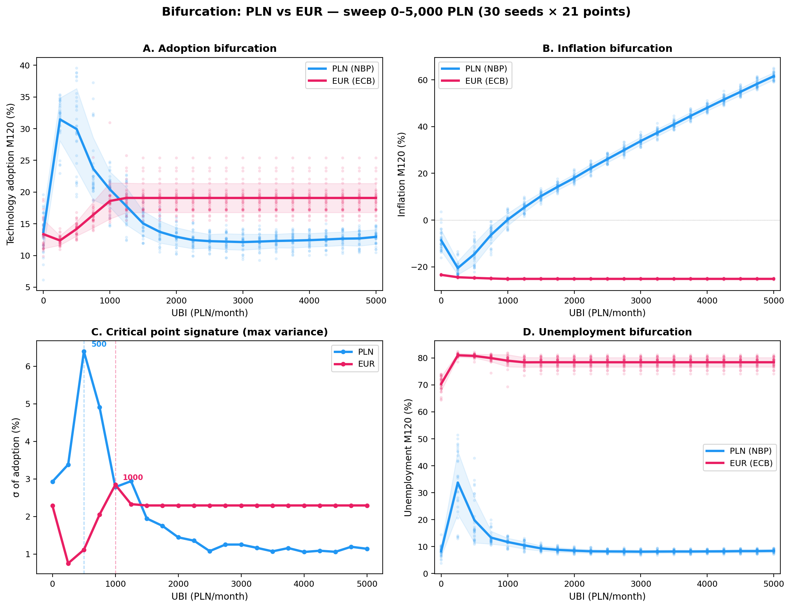
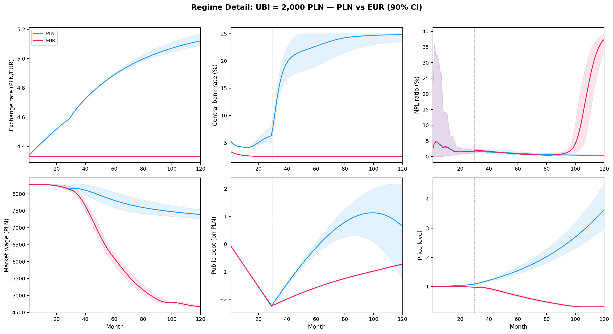
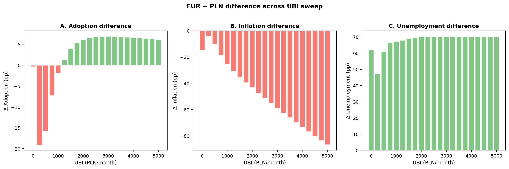
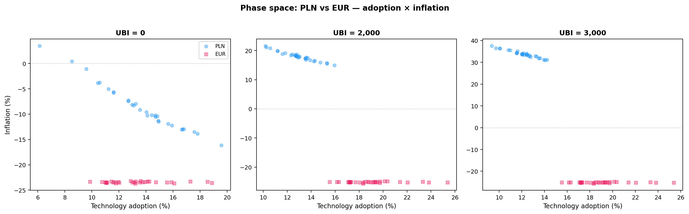
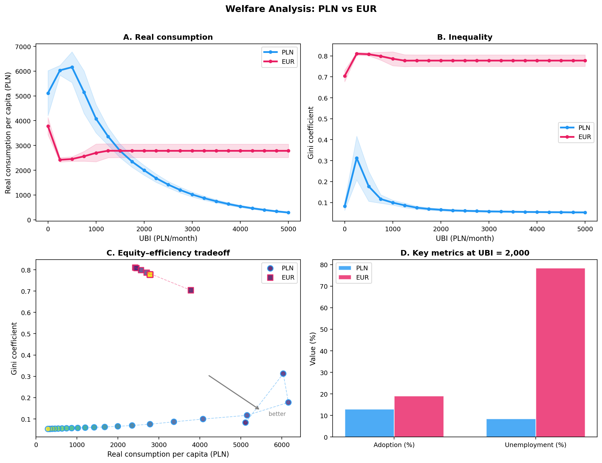

# Monetary Regime and the Acceleration Paradox

[](https://doi.org/10.5281/zenodo.18740933)

**PLN vs EUR counterfactual**: Does the acceleration paradox require monetary sovereignty?

## Summary

Paper-01 showed a phase transition at UBI = 2,000 PLN driven by NBP's endogenous Taylor rule and floating exchange rate. This paper tests whether the mechanism survives under Eurozone membership, where the ECB sets rates exogenously and the exchange rate is fixed.

**Key question**: Is monetary sovereignty a prerequisite for the acceleration paradox?

## Method

Same SFC-ABM as Paper-01 (10,000 firms × 6 sectors × Watts-Strogatz network × 120 months), with two monetary regimes:

| | PLN (NBP) | EUR (ECB) |
|---|---|---|
| Interest rate | Endogenous Taylor rule | Exogenous ECB Taylor rule (reacts to Eurozone inflation, not Polish) |
| Exchange rate | Floating, BoP-driven | Fixed at 4.33 PLN/EUR |
| Import prices | ER pass-through | No ER pass-through |
| Capital account | IRP arbitrage | Single monetary zone |

Full parameter sweep: 21 UBI levels (0–5,000 PLN) × 2 regimes × 30 seeds = **1,260 simulations**.

## Reproduce

Requires [complexity-econ/core](https://github.com/complexity-econ/core) (Scala 3 + sbt).

```bash
# Quick test (3 seeds)
cd ../core && sbt "run 2000 3 test_pln pln" && sbt "run 2000 3 test_eur eur"

# Full sweep
make simulate   # ~30 min

# Generate figures
make figures
```

## Structure

```
analysis/python/        Analysis & plotting scripts
figures/                Generated figures (PNG, 200 DPI)
latex/                  Paper (XeLaTeX)
simulations/results/    CSV output (pln/, eur/)
simulations/scripts/    Sweep runner
```

## Dependencies

- **Simulation**: [complexity-econ/core](https://github.com/complexity-econ/core) (Scala 3.5.2, sbt 1.10.6)
- **Analysis**: Python 3 (matplotlib, seaborn, scipy, numpy, pandas)
- **Paper**: XeLaTeX + biblatex

## Figures

### Bifurcation Comparison


**PLN vs EUR across the full BDP sweep.** Adoption, inflation, variance, and unemployment bifurcation diagrams for both regimes. PLN critical point at BDP = 500; EUR at BDP = 1000. The variance peak (susceptibility proxy) is sharper under PLN.

### Time Series


**Dynamic response over 120 months** for three BDP levels (0, 2000, 3000 PLN). PLN (blue) shows flexible adjustment — inflation rises but employment recovers. EUR (magenta) shows extreme deflation and persistent unemployment due to fixed exchange rate and SGP constraint.

### Regime Detail


**Six monetary channels at BDP = 2000 PLN.** Exchange rate, central bank rate, NPL ratio, wages, public debt, and price level. The EUR regime hits the SGP debt ceiling, capping effective UBI at ~1200 PLN — the fiscal constraint dominates everything downstream.

### Regime Difference


**EUR minus PLN difference across the BDP sweep.** Green = EUR outperforms, red = EUR underperforms. EUR achieves lower unemployment only at very high BDP (>3000), at the cost of extreme deflation and suppressed adoption everywhere else.

### Phase Space


**Terminal state scatter plots** (adoption × inflation) for three BDP levels. At BDP = 2000, PLN seeds spread across high-adoption/high-inflation territory while EUR seeds cluster in low-adoption/extreme-deflation — two fundamentally different macroeconomic regimes.

### Welfare Comparison


**Welfare metrics across the full sweep.** Real consumption, Gini, Pareto frontier, and summary bars. PLN dominates EUR in real consumption at nearly every BDP level. The Pareto frontier shows PLN achieves a strictly better equity-efficiency trade-off.

## License

MIT

## Related

- [Paper-01: The Acceleration Paradox](https://github.com/complexity-econ/paper-01-acceleration-paradox) — foundation model
- [Core engine](https://github.com/complexity-econ/core) — reusable SFC-ABM
